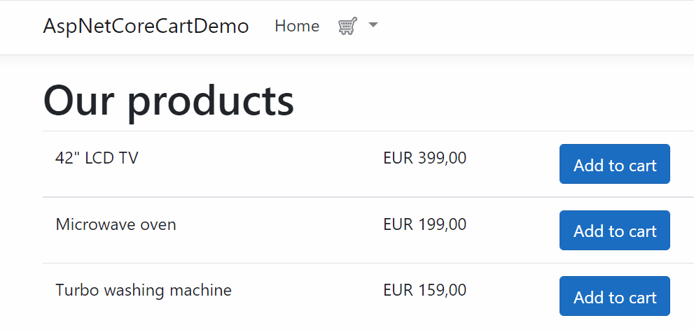

# ASP.NET Core Cart demo

This is a sample .NET 5 cart application demostrating how to use 2 different kind of backends:
 * The **Session**: carts will live in memory as ephemeral data. This is a discouraged solution since carts will disappear after a **1 minute period of inactivity**. See the implementation at [Models/Services/Infrastructure/SessionCartService.cs](Models/Services/Infrastructure/SessionCartService.cs);
 * A **Sqlite database** located in `/Data`: carts will survive even after the user restarts the browser or the application is restarted since a `cartId` will be saved on a pesistent cookie at the user's browsers. See the implementation at [Models/Services/Infrastructure/SqliteCartService.cs](Models/Services/Infrastructure/SqliteCartService.cs);

Choose the solution you want to use [here](Startup.cs#L38), in the `Startup` class by registering one of them to the [ICartService](Models/Services/Infrastructure/ICartService.cs) interface.
```csharp
// Choose SessionCartService OR SqliteCartService
// services.AddScoped<ICartService, SessionCartService>();
services.AddScoped<ICartService, SqliteCartService>();
```

